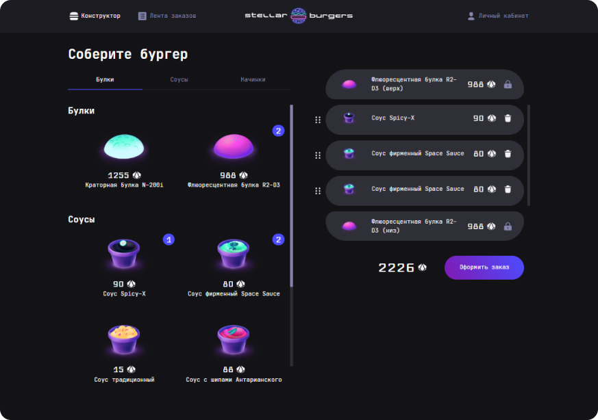
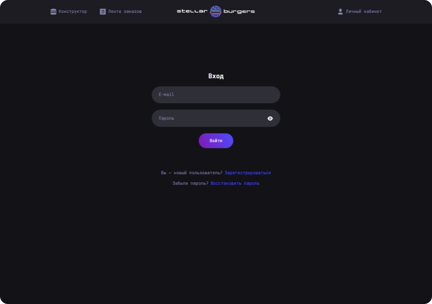
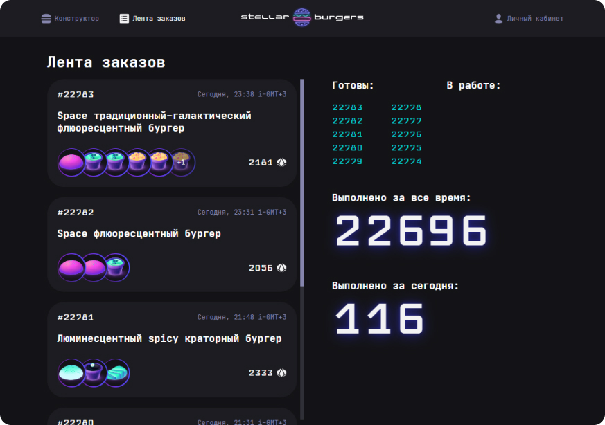
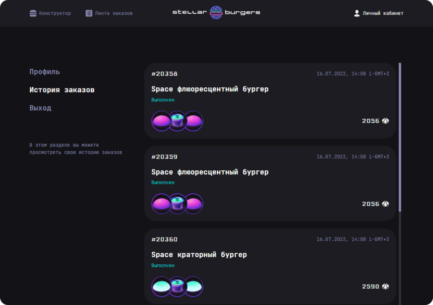

# Project Stellar Burger

**Stack:** React, CSS, JS, Redux, React Router, WebSocket, TypeScript.

[Link](https://geniav.github.io/react-burger/)

An app for desktop that helps users create their own burgers using different ingredients and place orders.

On the left side of this App user can choose buns, souses and fillings for his future burger.

If user clicks on ingredient's card, he will see ingredient details. Also user can update the page and see ingredient's details on the ingredient's individual page.

On the right side user sees his order, burger contains and the total price.
User can drag buns and ingredient from the left part and drop them into the right part (burger constructor).
It is also possible to reorder innner ingredients in the burger constructor and delete fillings.

In this project authorization is configured. User can place an order, if he has an account and is authorized.

On the left side of the Feed page there are the last 50 orders, that are gotten using WebSoket. On the right side you can see orders' statuses and information about orders' quantity in real time. It is also posible to open order details, if you click on the order.

On the Profile page users can find theirs own orders.
-------------------------
