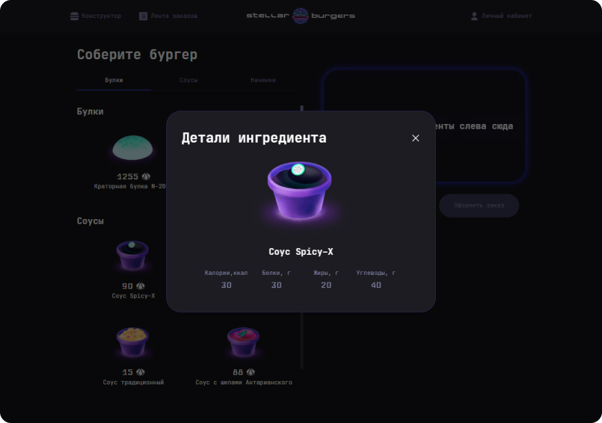

# Проект "Stellar Burger"

[Ссылка на проект](https://geniav.github.io/react-burger/)
-------------------------

**STACK**

JavaScript, CSS, JSX, React, Redux, React Router, WebSocket, TypeScript.

**ЦЕЛЬ ПРОЕКТА**

**Основная цель проекта –** изучить React, Redux, React Router, WebSocket, TypeScript и применить полученные знание на практике в данном учебном проекте.

**ОПИСАНИЕ**

Десктопное приложение, которое помогает пользователям создавать собственные бургеры из различных доступных ингредиентов и размещать заказы на эти бургеры. Слева можно выбирать булочки, начинки и соусы для будущих бургеров. Справа пользователь видит состав выбранного бургера и его стоимость. Сборка бургера осуществляется путем перетаскивания ингредиентов с левой части в правую ("drag and drop"). Также настроена опция удаления начинок и соусов из бургера и изменение порядка их размещения в бургере.


При клике на карточку с ингредиентом пользователь видит детали конкретного ингредиента. Если после клика обновить страницу, детали ингредиента откроются на отдельной странице.



Зарегистрированные пользователи могут размещать заказы.


Слева на странице «Лента заказов» посредством WebSocket подгружается 50 последних заказов бургерной. Справа в режиме реального времени отражаются статусы заказов. При клике на заказ также можно посмотреть его детали в попапе, при обновлении страницы – на отдельной странице.


В личном кабинете пользователь видит свои собственные заказы.


**ЗАПУСК ПРОЕКТА**

Необходима установка [Node.js](https://nodejs.org/en/).
Далее:

```sh
npm i --legacy-peer-deps
```
```sh
npm start
```
